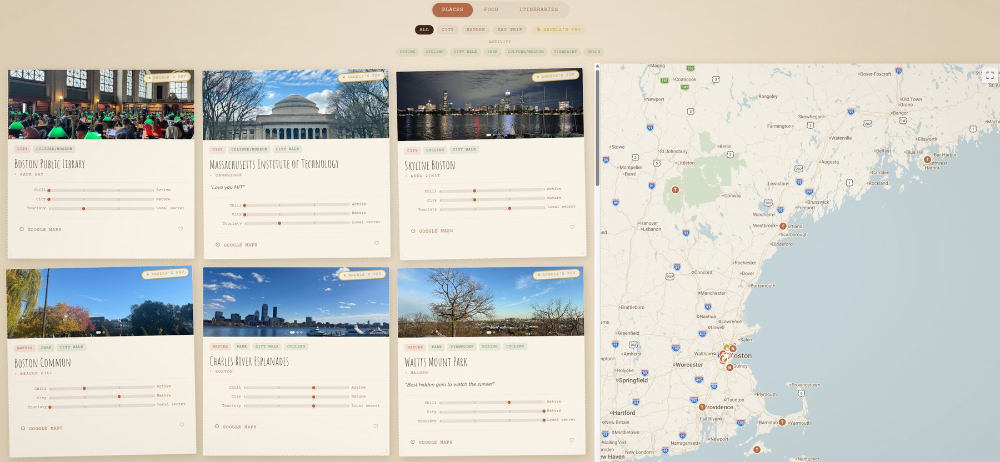
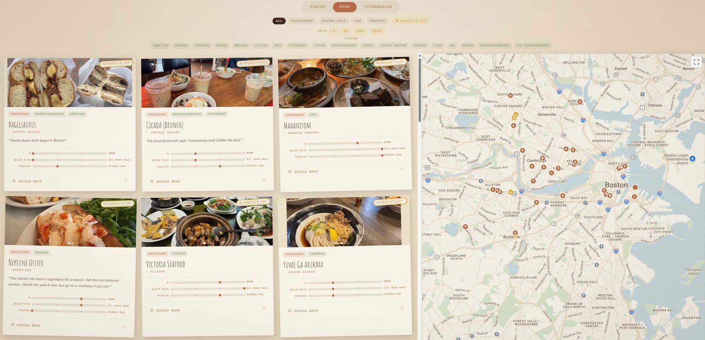
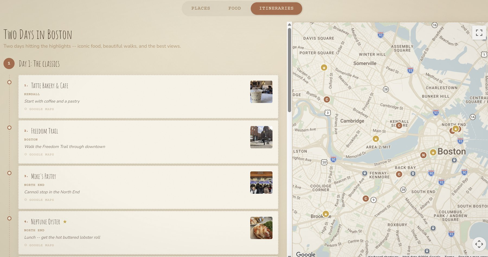

# Angela's Very Personal City Guide

A curated collection of my favorite restaurants, coffee shops, and places to explore in the cities I've called home — Boston and the Bay Area. Styled like a vintage scrapbook, because a city guide from a friend should feel like one.

**Live site:** [angela-city-guide.vercel.app](https://angela-city-guide.vercel.app)






---

## Why I built this

Friends kept asking me for recommendations every time they visited Boston or SF, and my answers were scattered across text threads and half-remembered Yelp bookmarks (9-year Yelp Elite here). So I turned them into a real product — designed, built, and shipped end-to-end with [Claude Code](https://claude.com/claude-code), going from idea to deployed site without writing the boilerplate myself.

## Features

- **66+ curated recommendations** across two cities, split into Food (restaurants, coffee shops, bars, dessert) and Places (city spots, nature, day trips)
- **Personal notes on every card** — what to order, when to go, and honest "spectrum bars" rating each spot on chill ↔ active, city ↔ nature, touristy ↔ local secret
- **Split view with a live map** — browse cards on the left while a synced Google Map tracks them on the right; hover a card and its pin highlights
- **Filters that match how you actually decide** — cuisine, price, must-try picks, and activity tags like Hiking, Viewpoint, or Culture/Museum
- **Sample itineraries** — day-by-day plans (like "Two Days in Boston") with stop-by-stop tips, plotted on the map
- **Save all places to Google Maps** — one click imports the whole guide as a Google Maps list for your trip
- **Guestbook & hearts** — visitors can leave a note or heart their favorite spots (powered by Firebase)
- Fully responsive, deployed on Vercel

## How it works

```
Me (locally, admin mode)              Visitors (deployed site)
────────────────────────              ────────────────────────
npm run dev                           Read-only static site
/boston?admin=true                    No admin code in the bundle
Add & edit cards in the browser       Guestbook + hearts write to
↓                                     Firebase Firestore
Export JSON from the admin toolbar    ↓
↓                                     Everything else = what I committed
src/data/boston.json
src/data/bay-area.json
↓
git commit && git push
↓
Vercel auto-deploys
```

### Admin mode is dev-only — on purpose

`?admin=true` only works under `npm run dev`. The production build tree-shakes all editing code out via `import.meta.env.DEV`, so the deployed site has no editing surface at all. Edits made in admin mode live in localStorage until exported to JSON via the admin toolbar, then committed like any other code change.

The only runtime backend is Firebase Firestore, used for the two genuinely dynamic features: the guestbook and heart counts.

## Project structure

```
src/
├── components/
│   ├── Layout/          # Landing page, city page, header
│   ├── Cover/           # Title spread
│   ├── Cards/           # Guide cards, spectrum bars, heart button
│   ├── Filters/         # Category tabs, cuisine/price/tag filters
│   ├── Map/             # Google Maps view with custom markers
│   ├── Itinerary/       # Day-by-day itinerary view + editor
│   ├── Guestbook/       # Visitor notes
│   └── Admin/           # Edit panel + JSON import/export (dev-only)
├── data/
│   ├── boston.json          # ← Guide entries live here
│   ├── bay-area.json
│   ├── boston-itineraries.json
│   ├── bay-area-itineraries.json
│   ├── cities.ts            # City list, map centers, zoom levels
│   ├── types.ts             # Entry types, cuisine & tag options
│   ├── storage.ts           # JSON loading + dev localStorage sync
│   ├── firebase.ts          # Firestore setup
│   ├── guestbook.ts         # Guestbook reads/writes
│   └── hearts.ts            # Heart counts per entry
└── index.css                # Theme: colors, fonts (Tailwind v4 @theme)
public/photos/               # Photos for every entry
```

## Customizing

This could easily become your own city guide — swap the data and the theme:

| Want to change…            | Edit                                        |
|----------------------------|---------------------------------------------|
| Cities (names, map center) | `src/data/cities.ts`                         |
| Guide entries              | `src/data/*.json` (or admin mode + export)   |
| Itineraries                | `src/data/*-itineraries.json`                |
| Cuisines & activity tags   | `src/data/types.ts`                          |
| Color palette & fonts      | `src/index.css` (`@theme` block)             |
| Photos                     | `public/photos/`                             |
| Site title & social cards  | `index.html`                                 |

## URL modes

| URL                          | What it does                                |
|------------------------------|---------------------------------------------|
| `/`                          | Cover page, city picker, and guestbook      |
| `/boston` · `/bay-area`      | City guide (Places / Food / Itineraries)    |
| `/boston?admin=true` *(dev only)* | Edit mode — only works under `npm run dev` |

## Tech stack

- **Frontend:** React 19 + TypeScript, React Router
- **Styling:** Tailwind CSS v4
- **Dynamic bits:** Firebase Firestore (guestbook, hearts)
- **Maps:** Google Maps JavaScript API
- **Build:** Vite
- **Deployment:** Vercel
- **Built with:** Claude Code

## Running locally

```bash
npm install
npm run dev
```

Then open http://localhost:5173 — no environment variables needed. Add `?admin=true` to a city page to enter edit mode.
